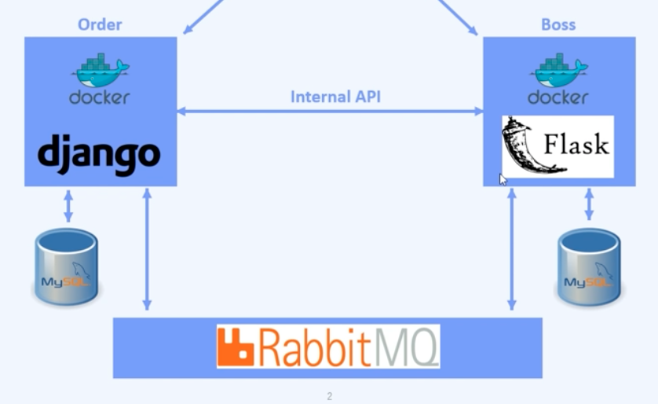

# microservice_delivery_app
This project is single host microservice architecture project that is implemented by Djanog and Flask. Two different services are isolated by Docker container and using two database for each services.
Two services are synchronizing their database by using RabbitMQ.

## Intro


Two independent services called Order, and Boss will be managed by Docker container. Two different databases that are used by each of Order and Boss, will be synchronized by RabbitMQ.

## Order
This service is implemeneted with Django.
It is for customer to save their order and track whether the order is delivered or not.

## Boss
This service is implemented with Flask, and it is for shop's boss to check what kind of orders they have to deliver.

The following commands are needed to migrate SQLAlchemy Models to MySQL database.
```bash
$ docker-compose exec backend sh
$ python manager.py db init
$ python manager.py db migrate
$ python manager.py db upgrade
```
